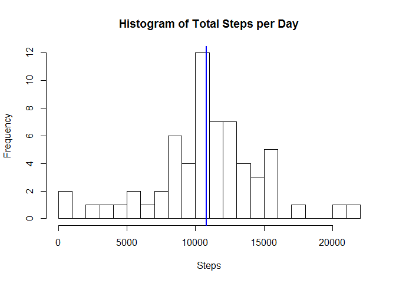

# Reproducible Research: Peer Assessment 1


## Loading and preprocessing the data
The data was obtained from the [course website][1] on 2015-10-15.  The following assumes the downloaded file
was unzipped and the file 'activity.csv' is in the working directory.


```r
activity <- read.csv("activity.csv")
```

The data appears to be in a mostly suitable format for analysis though there are a number of missing values which we will treat later in the analysis.  We'll do one minor step of converting the date column to actual dates.


```r
activity$date <- as.Date(activity$date)
```

## What is mean total number of steps taken per day?

First we'll aggregate the data by day and find the total steps for each day.  From those daily totals, we can plot a histogram of the total number of steps taken each day and calculate the mean and median.


```r
#aggregate ignores na values by default
dailyTotals <- aggregate(activity$steps, by = list(activity$date), FUN = sum)
meanSteps <- mean(dailyTotals$x, na.rm = TRUE)
medianSteps <- median(dailyTotals$x, na.rm = TRUE)
hist(dailyTotals$x, breaks = 20, xlab = "Steps", main = "Histogram of Total Steps per Day")
abline(v = meanSteps, col = "blue", lwd = 2)
```

 

The mean number of steps per day is **10766.19** (shown in blue on the histogram) and the median is **10765**.

## What is the average daily activity pattern?

In order to see the the average daily activity, we'll take the mean for each interval across all the days (again, ignoring missing values) and plot the average steps by interval.


```r
intervalMeans <- aggregate(activity$steps, by = list(activity$interval), mean, na.rm = TRUE)
plot(intervalMeans, type = "l", xlab = "Interval", ylab = "Average steps", main = "Average Daily Activity")
```

 

```r
maxInterval <- intervalMeans[which.max(intervalMeans$x),1]
```

The interval with the highest number of steps on average is **835**.

## Imputing missing values

A number of the intervals have missing data for the number of steps.


```r
totalMissing <- sum(is.na(activity$steps))
```

For the **2304** with no step count, we will impute the missing value by taking a random sample from all the other days for that interval for which there is data.  For example, for interval 600, there are 8 cases for which there are missing values.  For each of those, we will randomly choose the step count of one of the other 53 cases for interval 600 which do have data.


```r
completeData <- activity[complete.cases(activity),]
stepsByInterval <- split(completeData$steps, completeData$interval)
incompleteRows <- which(!complete.cases(activity))  # This works because steps is the only possible missing value

imputedActivity <- activity
set.seed(20151018)
for (i in seq_along(incompleteRows)) {
        interval <- imputedActivity[incompleteRows[i],3]
        imputedActivity[incompleteRows[i],1] <- sample(stepsByInterval[[as.character(interval)]], 1)
}
```

Now we'll do the same histogram and mean and median calculations as before to see what difference there may be between ignoring and imputing missing data.


```r
newDailyTotals <- aggregate(imputedActivity$steps, by = list(imputedActivity$date), FUN = sum)
hist(newDailyTotals$x, breaks = 20, xlab = "Steps", main = "Histogram of Total Steps per Day")
newMeanSteps <- mean(newDailyTotals$x)
newMedianSteps <- median(newDailyTotals$x)
abline(v = newMeanSteps, col = "blue", lwd = 2)
```

 

The mean is now **10779.49** (shown in blue), and the median is **10695**.  These are reasonably similar to the previous mean and median (10766.19, 10765).  The histogram is also very similarly shaped.

## Are there differences in activity patterns between weekdays and weekends?

We'll now add a variable to the data indicating whether the date is a weekday or weekend then plot the daily activity pattern for both side-by-side.


```r
imputedActivity$dayType <- as.factor(
        ifelse(weekdays(activity[,2]) %in% c("Saturday", "Sunday"),"weekend", "weekday")
        )
library(ggplot2)
```

```
## Warning: package 'ggplot2' was built under R version 3.2.2
```

```r
qplot(interval, steps, data = imputedActivity, 
      stat = "summary", fun.y = "mean", 
      geom = "line", facets = dayType ~ .)
```

 

Casual observation of the plot suggests that weekend activity begins somewhat later in the morning and doesn't peak so high, but shows somewhat more activity during the day and extending further into the evening than on the weekdays.
